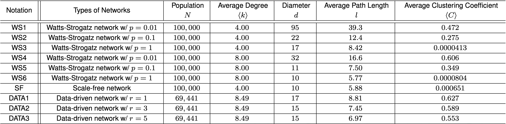

Tracing and testing multiple generations of close contacts to COVID-19: cost-benefit tradeoffs
===================================

### Abstract
Traditional contact tracing for COVID-19 tests the direct contacts of those who test positive even if the contacts do not show any symptom. But, by the time an infected individual is tested, the infection starting from the person may have infected a chain of individuals. Hence, why should the testing stop at direct contacts, and not test secondary, tertiary contacts or even contacts further down? One deterrent in testing long chains of individuals right away may be that it substantially increases the testing load, or does it? We investigate the costs and benefits of such multi-hop contact tracing for different number of hops. Considering a large number of contact topologies, spanning synthetic networks of divergent characteristics and those constructed from recorded interactions, we show that the cost-benefit tradeoff can be characterized in terms of a single measurable attribute, the *initial epidemic growth rate*. Once this growth rate crosses a threshold, multi-hop contact tracing substantially reduces the outbreak size compared to traditional contact tracing. Multi-hop even incurs a lower cost compared to the traditional contact tracing for a large range of values of the growth rate. The cost-benefit tradeoffs and the choice of the number of hops can be classified into three phases, with sharp transitions between them, depending on the value of the growth rate. The need for choosing a larger number of hops becomes greater as the growth rate increases or the environment becomes less conducive toward containing the disease.

### Contact Networks
 
*Notes:* *p* is the rewiring probability of Watts-Strogatz networks, and *r* is the mixing parameter in data-driven network. The average degree is the average number of edges per node. The distance between a pair of nodes is the length of the shortest path between them. The diameter is the maximum value of this distance over all pairs of nodes. The average path length is the average of this distance over all pairs of nodes; only the lengths of the existing paths are considered and averaged. Clustering coefficient of a node *i*, *Ci*, is defined as the ratio between the actual number of links between the neighbors of *i* and the maximum possible number of links between the neighbors of *i*. This is high if there exists a large number of edges in the neighborhood of *i*. The average clustering coefficient, *\langle C \rangle*, is the average of *Ci* over all nodes *i*. The average degree, average path length, and average clustering coefficient are rounded to three significant figures.

#### Each row/record in the datasets represents a link between two nodes in undirected networks.
#### The raw data used to construct data-driven network was previously published in *A Banerjee, AG Chandrasekhar, E Duflo, MO Jackson, The diffusion of microfinance. Science 341 (2013)*. 
